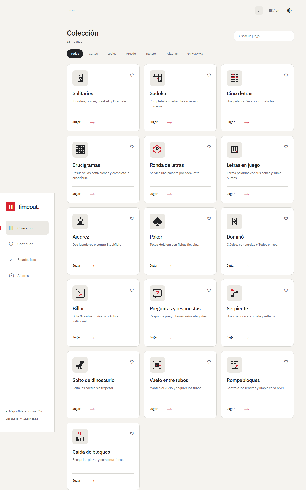
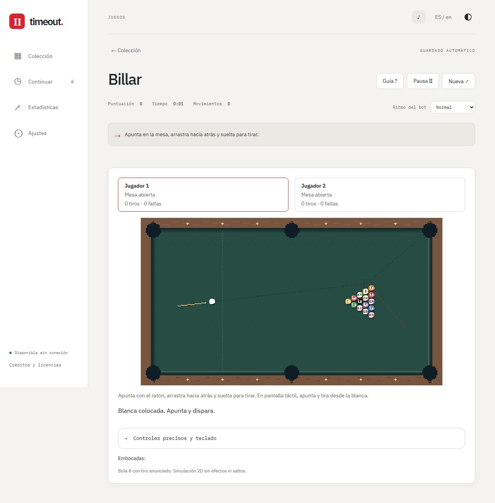

# Timeout

16 juegos de cartas, palabras, tablero y arcade para jugar en el navegador. Sin cuentas, sin anuncios y sin conexión durante las partidas.

Gráficos pixel art, español e inglés, temas claros y oscuros, guardado automático y rivales controlados por el ordenador. También puedes jugar con otras personas compartiendo un dispositivo.

## Jugar

Descarga una versión desde [Releases](https://github.com/pablordgez/timeout/releases):

- **Portable:** abre `timeout.html` en un navegador de escritorio. Es un único archivo y funciona sin instalar nada.
- **Web:** publica el contenido del paquete web en un alojamiento estático con HTTPS. Después de la primera visita, espera a «Disponible sin conexión» para jugar sin red. Puedes instalarlo como aplicación desde el navegador.

Elige un juego, configura la partida y pulsa **Empezar**. Las partidas pendientes aparecen en **Continuar**; cada juego tiene una **Guía** con sus controles y reglas.

Los guardados se quedan en tu navegador. Para trasladarlos o conservar una copia, usa **Ajustes → Exportar todos los datos** e **Importar copia**. Exporta antes de mover el HTML portable o borrar los datos del navegador.

## Juegos

| Juego                  | Qué incluye                                                  |
| ---------------------- | ------------------------------------------------------------ |
| Solitarios             | Klondike, Spider, FreeCell y Pirámide; pistas y deshacer.    |
| Sudoku                 | Cuatro dificultades, notas y ayudas.                         |
| Cinco letras           | Una palabra de cinco letras y seis intentos.                 |
| Crucigramas            | Tres tamaños de cuadrícula y nuevas partidas generadas.      |
| Ronda de letras        | Una definición por letra, con tiempo configurable.           |
| Letras en juego        | Forma palabras con tus fichas en un tablero; 2–4 jugadores.  |
| Ajedrez                | Dos personas o contra Stockfish.                             |
| Póker                  | Texas Hold’em con fichas ficticias; 2–6 jugadores.           |
| Dominó                 | Clásico, parejas y Todos cincos con ramas y puntos por jugada. |
| Billar                 | Bola 8 y práctica individual.                                |
| Preguntas y respuestas | Seis categorías; 500 preguntas en español y 500 en inglés.   |
| Serpiente              | Recoge comida y evita chocar.                                |
| Salto de dinosaurio    | Salta los cactus mientras aumenta la velocidad.              |
| Vuelo entre tubos      | Da impulsos al pájaro para atravesar los huecos.             |
| Rompebloques           | Pala, pelota, ladrillos y niveles.                           |
| Caída de bloques       | Reglas modernas o clásicas; líneas, contrarreloj o infinito. |

Los juegos de palabras y preguntas permiten elegir español o inglés al iniciar la partida.

## Capturas





## Construir

Necesitas **Node.js 22.12 o posterior** y npm.

```sh
npm ci
npm run build
```

Se generan dos versiones:

- `dist/`: web lista para un alojamiento estático.
- `dist-portable/index.html`: archivo portable autocontenido.

Para probar la web en tu equipo, ejecuta `npx vite preview`. Para preparar los paquetes web, portable y de código fuente, haz un commit y ejecuta `npm run release`; estarán en `artifacts/`. Este último paso puede descargar el código fuente de Stockfish.

La web incluye una política de seguridad en el HTML y un archivo `_headers` para alojamientos compatibles, como Netlify o Cloudflare Pages. En otros servidores, configura las cabeceras equivalentes para bloquear también su inclusión en marcos.

## Licencia

El código se distribuye bajo [GPL-3.0-only](LICENSE). Las distribuciones deben incluir el código fuente correspondiente y los avisos de [licenses/](licenses/).

Las palabras proceden de Wikcionario/Wiktionary, vía Kaikki/Wiktextract, y las preguntas inglesas de Open Trivia DB; sus paquetes conservan CC BY-SA 4.0. Las preguntas españolas combinan contenido original con una selección de [Spanish general knowledge database](https://doi.org/10.6084/m9.figshare.13041803.v2), bajo CC BY 4.0. Stockfish usa GPLv3 y las tipografías IBM Plex, SIL OFL. Los créditos y textos de licencia también están disponibles dentro del juego.
